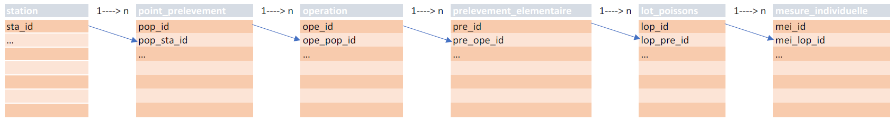

```{r setup, include = FALSE}
knitr::opts_chunk$set(echo = TRUE, message = FALSE, warning = FALSE)
```

# Chargement des packages et des données ASPE

```{r}
library(aspe)
library(tidyverse)
library(COGiter)
library(sf)

```


```{r, echo = FALSE}
rdata_tables <- misc_nom_dernier_fichier(repertoire = "raw_data",
                                         pattern = "^tables")

load(rdata_tables)
```


```{r, eval = FALSE}
load(file = "../raw_data/tables_sauf_mei_2022_03_08_17_55_06.RData") # chargement autres tables
```


# Bassin Adour-Garonne

On utilise ici le package {tod} (pour Télécharger Open Data) qui permet d'accéder à divers jeux de données ouverts, dont les [flux WGS du Sandre](https://rpubs.com/kamoke/840172).

```{r, echo = FALSE}
load("../processed_data/ag.RData")
```


```{r, eval = FALSE}
ag <- tod::wfs_sandre(url_wfs = "https://services.sandre.eaufrance.fr/geo/topage?",
                      couche = "BassinHydrographique")  %>%
  filter(LbBH == "Adour-Garonne") %>% 
  sf::st_buffer(dist = units::set_units(1, km)) # petit buffer pour ne rien manquer en limite

mapview::mapview(ag)
```


```{r}
bv <- tod::wfs_sandre(url_wfs = "https://services.sandre.eaufrance.fr/geo/sandre",
                      couche = "SecteurHydro_FXX") %>% 
  filter(CdRegionHydro %in% c("O", "P", "Q", "R", "S"))

mapview::mapview(ag) +
  mapview::mapview(bv, col.regions = "red")
```


# Sélection des points de prélèvement

Dans la base, les "points de prélèvement" et les "stations" sont géoréférencés. Il peut y avoir plusieurs points pour une même station. Une opération de pêche est toujours rattachée à un point mais un point n'est pas toujours rattaché à une station. On choisit donc de considérer les données ponctuelles à l'échelle du point.

On veut donc identifier les points qui sont dans le périmètre du bassin Adour-Garonne. Une difficulté vient de la nécessité d'homogénéiser les systèmes de coordonnées qui cohabitent dans la base ASPE. Les étapes sont :

- Ajout du code EPSG au `dataframe` `point_prelevement`
- Création d'un `dataframe` associant à chaque code point ses coordonnées
- Jointure entre les deux
- Filtre pour ne conserver que les points situés sur le bassin Adour-Garonne

```{r}
# ajout code EPSG
point_prelevement <- point_prelevement %>%
  left_join(y = ref_type_projection,
            by = c("pop_typ_id" = "typ_id"))

# dataframe des coordonnées (ici en epsg 4326 donc WGS84)
coords <- geo_convertir_coords_df(
  df = point_prelevement,
  var_x = pop_coordonnees_x,
  var_y = pop_coordonnees_y,
  var_id = pop_id,
  var_crs_initial = typ_code_epsg,
  crs_sortie = 4326
)

# ajout des coordonnées et conversion en objet de classe sf (spatial)
point_prelevement <- point_prelevement %>%
  left_join(y = coords) %>%
  st_as_sf(coords = c("X", "Y"),
           crs = 4326)

# intersection géographique et collecte des identifiants des points sélectionnés
pops_ag <- point_prelevement %>%
  st_join(ag) %>%
  filter(LbBH == "Adour-Garonne") %>%
  pull(pop_id)
```

# Sélection des opérations

Ici on opère les jointures entre les différentes tables de la base Aspe. Les relations sont de type 1 $\rightarrow$ n et hiérarchisées dans l'ordre :

1. station
2. point_prelevement
3. operation
4. prelevement_elementaire (ex : passage en pêche complète à plusieurs passages)
5. lot_poissons
6. mesure_individuelle



Les mesures individuelles étant, de loin, la table la plus volumineuse, on ne l'importe que si l'on en a besoin ce qui n'est pas le cas à ce stade où l'on se contente des lots.

La fonction `mef_creer_passerelle()` du package `{aspe}` réalise ces jointures entre les indentifiants des tables `station` à `lot_poissons`, ce qui permet de filtrer la région sur les identifiants des points, après quoi on peut ajouter d'autres informations à l'aide des fonctions préfixées `mef_`.

```{r}
ope_ag <- mef_creer_passerelle() %>% # mise en relation des identifiants des différentes tables
  filter(pop_id %in% pops_ag) %>% # sélection des points en A-G
  mef_ajouter_libelle() %>%
  mef_ajouter_ope_date() %>%
  mef_ajouter_lots()
```

NB : la fonction `mef_ajouter_libelle()` ajoute les libellés des points. S'ils ne sont pas renseignés, c'est le libellé station Sandre qui est renvoyé. Si les deux sont manquants c'est l'identifiant du point `pop_id`.

# Assemblage / filtrage / agrégation des données

On ajoute le protocole employé afin de pouvoir si besoin filtrer dessus, sélectionne les variables d'intérêt puis agrège les lots pour obtenir les effectifs par espèce pour chaque opération.

```{r}
data <- ope_ag %>%
  mef_ajouter_type_protocole() %>%
  select(
    sta_id,
    pop_id,
    pop_libelle,
    ope_id,
    ope_date,
    pro_libelle,
    annee,
    esp_code_alternatif,
    lop_id,
    lop_effectif
  ) %>%
  distinct() %>%  # pour éviter doublons des opérations appartenant à plusieurs réseaux
  group_by(sta_id,
           pop_id,
           pop_libelle,
           ope_id,
           ope_date,
           pro_libelle,
           annee,
           esp_code_alternatif) %>%
  summarise(effectif = sum(lop_effectif, narm = TRUE)) %>%
  ungroup()
```

# Données à l'opération

Pour chaque opération on calcule l'effectif de spirlin et des variables pour aider à l'interprétation.

```{r}
ope_data <- data %>%
  group_by(sta_id,
           pop_id,
           pop_libelle,
           ope_id,
           ope_date,
           annee) %>%
  summarise(eff_tot = sum(effectif, na.rm = TRUE), # effectif total capturé
            nb_esp = n_distinct(esp_code_alternatif), # richesse en espèces
            eff_spi = sum(effectif[esp_code_alternatif == "SPI"]) # effectif en spirlin
            ) %>%
  mutate_at(vars(eff_tot:eff_spi),
            replace_na,
            replace = 0) %>%
  mutate(eff_non_spi = eff_tot - eff_spi) %>% # effectif hors spirlin
  relocate(eff_tot, .after = last_col()) %>% 
  ungroup()
```

```{r, echo = FALSE}
DT::datatable(ope_data)

downloadthis::download_this(ope_data,
                            output_name = "ope_data",
                            output_extension = ".xlsx",
                            button_label = "Télécharger le tableau",
                            button_type = "success")
```


# Données au point

On procède comme à l'opération sauf que l'agrégation est au point.

```{r}
pop_data <- data %>%
  group_by(sta_id, pop_id, pop_libelle) %>%
  summarise(
    nb_ope = n_distinct(ope_id), # nb d'opérations sur le pop
    nb_ope_avec_spi = n_distinct(ope_id[esp_code_alternatif == "SPI"]), # nb d'opérations sur le pop avec SPI
    nb_ope_ss_spi = nb_ope - nb_ope_avec_spi, # nb d'opérations sur le pop sans SPI
    nb_esp = n_distinct(esp_code_alternatif), # richesse totale, toutes opérations confondues
    pc_pres_spi = round(nb_ope_avec_spi / nb_ope, 2), # % des opérations où SPI était présent
    annee_arrivee_spi = min(annee[esp_code_alternatif == "SPI"]) # année d'arrivée du SPI
    ) %>% 
  ungroup()

DT::datatable(pop_data)
```

```{r, echo = FALSE}
downloadthis::download_this(pop_data,
                            output_name = "pop_data",
                            output_extension = ".xlsx",
                            button_label = "Télécharger le tableau",
                            button_type = "success")
```

# Exemples de visualisation

## Une carte

La taille du point est en nombre d'opérations avec présence du Spirlin.
    
```{r}
pop_map_data <- pop_data %>% 
  left_join(y = coords) %>% 
  st_as_sf(coords = c("X", "Y"), crs = 4326) %>% 
  filter(nb_ope_avec_spi > 0)

mapview::mapview(bv,
                 zcol = "LbSecteurHydro",
                 legend = FALSE,
                 alpha.regions = 0.05) +
mapview::mapview(x = pop_map_data,
                 cex = "nb_ope_avec_spi",
                 legend = TRUE)
```

## Un graphique

```{r}
ope_data %>% 
  group_by(annee) %>% 
    summarise(nb_pop_avec_spi = n_distinct(pop_id[eff_spi > 0])) %>% 
  ungroup() %>%
  ggplot(aes(x = annee,
             y = nb_pop_avec_spi)) +
  geom_line() +
  labs(x = "",
       y = "Nombre de points avec du spirlin")
```

```{r}
save(ope_data,
     pop_data,
     operation_ipr,
     point_prelevement,
     station,
     classe_ipr,
     file = "../processed_data/spirlin_dfs.RData")
```

